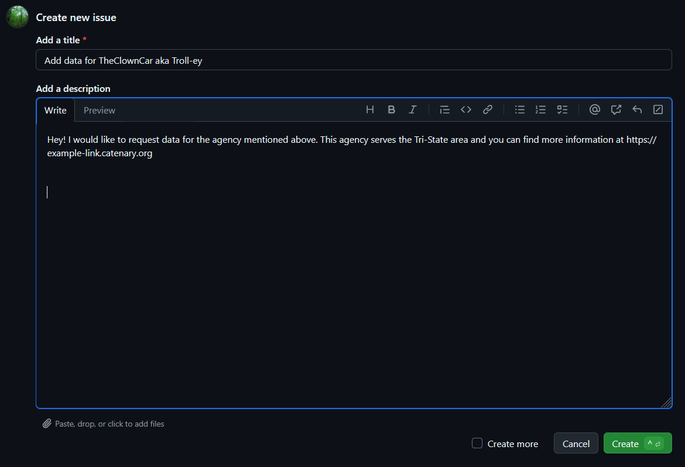

## Ich möchte helfen, aber ich programmiere nicht!

Wir verstehen, dass Programmieren nicht jedermanns Sache ist, aber es gibt trotzdem viele Dinge, bei denen Sie uns helfen können, auch wenn Sie nicht programmieren (können/wollen) :D
 

**Verkehrsbetriebe hinzufügen:**
Ist Ihnen ein Verkehrsbetrieb aufgefallen, den wir nicht haben? Lassen Sie uns auf Github Issues wissen, was uns fehlt! Gehen Sie zu diesem [Link](https://github.com/catenarytransit/vehicles/issues) und Sie sollten den folgenden Bildschirm sehen:

Drücken Sie den grünen Knopf mit der Aufschrift "New issue" oben rechts auf dem Bildschirm, unter der oberen Leiste.

Wenn Sie kein Github-Konto haben, registrieren Sie sich bitte!
Wenn Sie eines haben, können Sie das Formular mit dem Verkehrsbetrieb ausfüllen, den Sie hinzufügen möchten.

Um Ihnen zu helfen, haben wir eine Vorlage geschrieben! Kopieren Sie einfach die folgenden Informationen in jedes Feld und ersetzen Sie die Informationen in Klammern durch das, was Sie wissen. Es ist in Ordnung, wenn Sie auch nicht alle dieser Informationen haben, wir können helfen, sie zu finden!

- Title: Add data for [Vollständiger Name des Verkehrsbetriebs] aka [Abkürzung oder Kurzname des Verkehrsbetriebs]
- Add a description: Hey! I would like to request data for the agency mentioned above. This agency serves the [Region] area and you can find more information at [offizielle Website oder, noch besser, API für deren Daten!].

Dieses Bild zeigt ein Beispiel, wie es aussehen könnte:

Nachdem Sie das ausgefüllt haben, klicken Sie einfach auf den grünen Knopf mit dem Wort "Create" und schon sind Sie fertig!

Eine letzte Anmerkung: Nicht alle Verkehrsbetriebe veröffentlichen ihre Daten und nicht alle Daten sind auf unser System standardisiert. Wir werden unser Bestes tun, um die Informationen zu beschaffen, um Catenary zu aktualisieren, aber wir können nicht mit Sicherheit sagen, dass wir alles hinzufügen können, was Sie brauchen :pensive:
 

**Website-Übersetzungen:**
Schreiben Sie in einer Sprache, die Sie auf Catenary nicht sehen? Wir könnten Ihre Expertise gebrauchen! Catenary zielt darauf ab, eine vollständige Internationalisierung (Mehrsprachigkeit!) zu bieten, daher freuen wir uns immer, wenn unsere Benutzer uns bei Übersetzungen helfen!

Da unsere Website/Karte Open Source und für öffentliche Mitwirkende offen ist, müssen Sie nur auf unsere GitHub-Seite gehen und einen kleinen Vorschlag namens "Pull Request" verfassen.

Gehen Sie zuerst zu diesem [Link](https://github.com/catenarytransit/ADD-LINK-HERE) und Sie sollten den folgenden Bildschirm sehen:
