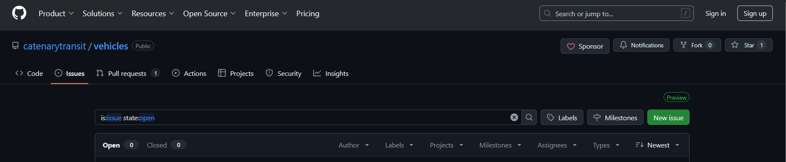
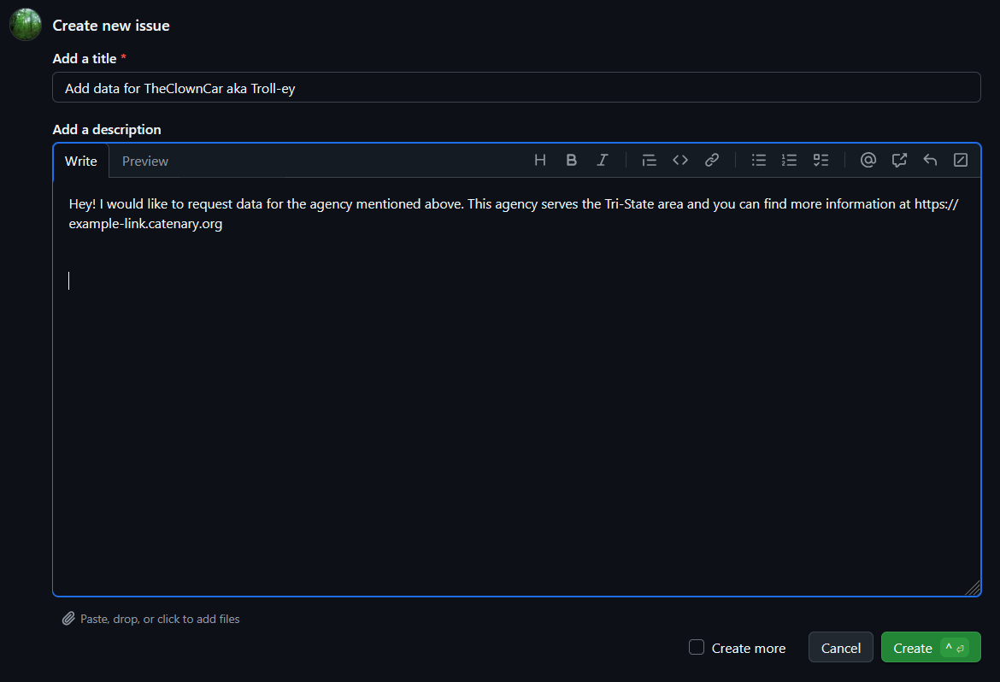

## I want to help, but I don't code!

We understand that coding isn't for everyone, but there's still many things that you can help us with, even if you don't/can't/won't code :D 
 

**Adding agencies:**
Notice that there's an agency we don't have? Let us know what we're missing on Github Issues! Go to this [link](https://github.com/catenarytransit/vehicles/issues) and you should see the following screen:

Press the green button that says "New issue" near the top right of the screen, under the topbar. 

If you don't have a github account, please sign up!
If you do, you can fill out the form with the agency that you want to add. 

To help you out, we wrote a template! Just copy-paste the following information into each field and replace the bracketed information with what you know. It's alright if you don't have all of this information too, we can help find it!

- Title: Add data for [Full name of Agency] aka [Abbreviated or short name of Agency]
- Add a description: Hey! I would like to request data for the agency mentioned above. This agency serves the [region] area and you can find more information at [official website, or, even better, API for their data!]. 

This image shows and example of what it may look like:

After you fill that out, just hit the green button with the word "Create" on it and you're good to go!

One last note: Not all agencies publish their data and not all of the data is standardized to our system. We will try our best to aquire the information to update Catenary, but we can't say for sure that we can add everything you need :pensive:
 

**Website Translations:**
Write in a language that you don't see on Catenary? We could use your expertise! Catenary aims to have full internationalization (multilingualism!), so we always love it when our users help us with translations! 

Since our website/map is open-source and open for public contributors, all you need to do is go to our GitHub page and write up a little suggestion-note called a "pull request". 

First, go to this [link](https://github.com/catenarytransit/ADD-LINK-HERE) and you should see the following screen:

    