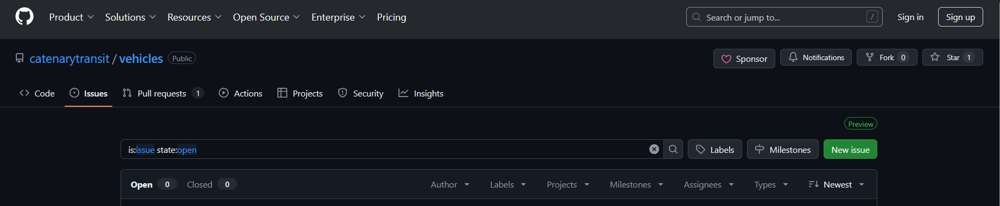

## I want to help, but I don't code!

We understand that coding isn't for everyone, but there's still many things that you can help us with, even if you don't/can't/won't code :D 

**Adding agencies:**
Notice that there's an agency we don't have? Let us know what we're missing on Github Issues! Go to this [link](https://github.com/catenarytransit/vehicles/issues) and you should see the following screen:

Press the green button that says "New issue" near the top right of the screen, under the topbar. 

If you don't have a github account, please sign up!
If you do, you can 