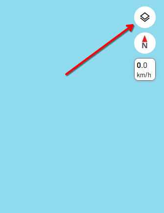
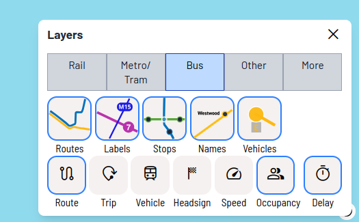

# New York City

Catenary is a transit app that helps you see where your bus or train is, anywhere in New York City and its suburbs.  
Watch live departures, explore nearby stops, and check service alerts — all from one place.

[**Launch Catenary**](https://maps.catenarymaps.org/#pos=11.5/40.7358/-74.0011)

## Supported agencies

With Catenary, you can see all of the bus routes and train lines operated by the following agencies, view upcoming departures, and view their timetables. Also, most of them provide realtime data, so you can know if your train/bus is late and see individual vehicles on the map.

## Rail

* MTA NYCT New York City Subway
  * Realtime train positions, predicted arrival times, and alerts are supported
* MTA Metro-North Railroad
  * Realtime train positions, predicted arrival times, and alerts are supported
* MTA Long Island Railroad
  * Realtime train positions, predicted arrival times, and alerts are supported
* New Jersey Transit Rail Operations commuter rail
  * Realtime train positions, predicted arrival times, and alerts are supported
* AirTrain Newark
  * No realtime data is available
* Port Authority Trans-Hudson
  * No realtime data is available
* Amtrak and CTtransit Shore Line East
  * Realtime train positions, predicted arrival times, and alerts are supported
* CTtransit Hartford Line
  * It is unknown if realtime data is provided by CTtransit

### Bus

#### Public operators
* MTA New York City Bus
  * Realtime bus positions, predicted arrival times, and alerts are supported
* NJ Transit
  * Realtime bus positions, predicted arrival times, and alerts are supported
* CTtransit
  * Realtime bus positions, predicted arrival times, and alerts are supported
* Westchester County, NY - Bee-Line System
  * Realtime bus positions, predicted arrival times, and alerts are supported
* Town of Clarkstown, Westchester County, NY - Clarkstown Mini Trans
  * No realtime data is available
* Lower Hudson Transit Link
  * No realtime data is available
* Hudson Rail Link
  * No realtime data is available
* Putnam County, NY - Putnam Area Rapid Transit
  * No realtime data is available
* Housatonic Area Regional Transit
  * Realtime bus positions, predicted arrival times, and alerts are supported
* Norwalk Transit District
  * Realtime bus positions, predicted arrival times, and alerts are supported

#### Private operators
* Coach USA and Megabus
  * No realtime data is available
* Monsey Trails
  * No realtime data is available

## Not supported

### Rail

* Hudson-Bergen Light Rail
* Newark Light Rail, including Newark City Subway
* AirTrain JFK

### Bus

* Jitneys
* Most private bus operators
* Somerset County, NJ - Somerset Transit
* Middlesex County, NJ - Middlesex County RIDE
* Rockland County, NY - Transport of Rockland
  * The feed [is outdated and has errors](https://mobilitydatabase.org/feeds/gtfs/tld-3368)

## Frequently asked questions

### Does Catenary show real-time data in New York City?
Yes. Catenary provides live train locations and estimated departure times in New York City.

We also provide live bus locations in the New York City suburbs, but unfortunately CTA does not provide live bus locations in a format we can use.

### Does Catenary show service alerts in New York City?

We show service alerts for Metra trains. Unfortunately, CTA, Pace, and NICTD do not provide service alerts in a format we can use.

### Do I need to download an app?
No. Catenary runs directly in your browser — just click [**Launch Catenary**](https://maps.catenarymaps.org/#pos=11.5/40.7358/-74.0011).

### Is Catenary free to use?
Yes. It’s completely free and works on mobile or desktop.

### When does the next bus/train arrive?

[**Launch Catenary**](https://maps.catenarymaps.org/#pos=11.5/40.7358/-74.0011) and search for your stop, or zoom in to find it. After clicking on the stop, the next arrivals will show up.

### Which bus stop or train station is closest to me?

[**Launch Catenary**](https://maps.catenarymaps.org/#pos=11.5/40.7358/-74.0011) and your current location will appear. You can browse the map to find the nearest stop.

### I only care about trains; can I hide the buses?

Yes; in the top-right corner you can click on the "layer" icon...

... and hide what you don't want to see:

## Diagrams and PDF maps

### Rail system
* [New York City Subway diagram (official)](https://www.mta.info/map/5256) ([late night service](https://www.mta.info/map/5336))
* [New York City Subway map (official)](https://www.mta.info/map/36946) ([late night service](https://www.mta.info/map/36951))
* [Commuter rail diagram (unofficial, made by Theodorae Ditsek)](https://theoditsek.wordpress.com/2025/10/17/new-york-city-commuter-rail-map/)
* [Metro-North and Long Island Railroad diagram (official)](https://www.mta.info/map/22461)
* [NJ Transit rail system diagram (official)](https://content.njtransit.com/sites/default/files/pdfs/maps/RSM_Geographic_071525_web.pdf)

### Major rail stations

* [New York Penn Station (unofficial)](https://jasongibbs.com/pennstation/) ([PDF](https://jasongibbs.com/pennstation/download.php))
* [Grand Central Station (unofficial, PDF)](https://jasongibbs.com/grandcentral/download.php)
* [Newark Penn Station (official, PDF)](https://web.archive.org/web/20251110010236if_/https://content.njtransit.com/sites/default/files/pdfs/maps/NewarkPenn_Directory_8-21.pdf)

### Buses

Note that most of these buses are also on Catenary Maps!

#### New York City

* [Manhattan](https://www.mta.info/map/5391) ([bus service guide](https://www.mta.info/document/8331))
* [The Bronx](https://www.mta.info/map/5366) ([bus service guide](https://www.mta.info/document/4596))
* [Brooklyn](https://www.mta.info/map/5261) ([bus service guide](https://www.mta.info/document/4146))
* [Queens](https://www.mta.info/map/5371)
* [Queens express buses](https://www.mta.info/map/40256)
* [Staten Island](https://www.mta.info/map/5376) ([bus service guide](https://www.mta.info/document/4131))
* [Staten Island express buses](https://www.mta.info/map/5381) ([bus service guide](https://www.mta.info/document/4136))

#### New Jersey

* [New Brunswick, NJ](https://newbrunswickbuses.com/wp-content/uploads/2023/06/New-Brunswick-System-Map-01.png) ([bus service guide](https://newbrunswickbuses.com/))

#### North suburbs

* [Westchester County (Bee Line)](https://transportation.westchestergov.com/images/Schedules/systemmapeng0625.pdf)
* [Rockland County (Transport of Rockland)](https://www.rocklandcountyny.gov/home/showpublisheddocument/1776/638217172466200000)

#### Long Island

* [Nassau County (NICE)](https://www.nicebus.com/getattachment/Tools/Maps-and-Schedules/PRINT_WEB-System-Map.pdf.aspx?lang=en-US)

### Additional resources

* [More MTA maps and diagrams](https://www.mta.info/maps)

## Frequently asked questions

### Does Catenary show real-time data in New York City?
Yes. Catenary provides live train locations and estimated departure times in New York City and its suburbs, for most operators (see the above list). Some operators are not supported.

### Does Catenary show service alerts in New York City?

Yes. Catenary provides service alerts in New York City and its suburbs, for most operators (see the above list).  Some operators are not supported.

### Do I need to download an app?
No. Catenary runs directly in your browser — just click [**Launch Catenary**](https://maps.catenarymaps.org/#pos=11.5/40.7358/-74.0011).

### Is Catenary free to use?
Yes. It’s completely free and works on mobile or desktop.

### When does the next bus/train arrive?

[**Launch Catenary**](https://maps.catenarymaps.org/#pos=11.5/40.7358/-74.0011) and search for your stop, or zoom in to find it. After clicking on the stop, the next arrivals will show up.

### Which bus stop or train station is closest to me?

[**Launch Catenary**](https://maps.catenarymaps.org/#pos=11.5/40.7358/-74.0011) and your current location will appear. You can browse the map to find the nearest stop.

### I only care about trains; can I hide the buses?

Yes; in the top-right corner you can click on the "layer" icon...

... and hide what you don't want to see:

## How to help out

The progress of adding support for New York Cityland transit operators is tracked at the following spreadsheet:
<https://docs.google.com/spreadsheets/d/15wKbfusysMrV_2lPuMFXCFsSg-TPV31qtbukZi4sEmU/edit>

CTA realtime data is processed by [@catenarytransit/New York City-gtfs-rt](https://github.com/catenarytransit/New York City-gtfs-rt).

If you want to improve our data/maps, [join our Discord](https://discord.gg/bBeDhrzSgz) and head to one of the following threads/channels:

* [#general](https://discord.com/channels/1148092048625385552/1148092049413918772) - for problems unrelated to the specific agency
* [New York area track numbers](https://discord.com/channels/1148092048625385552/1437215592632291471)
* [NJ Transit](https://discord.com/channels/1148092048625385552/1163376060252041246)
* [Long Island Railroad](https://discord.com/channels/1148092048625385552/1432912735661850795)
* [PATH (Newark-Manhattan)](https://discord.com/channels/1148092048625385552/1399870670606700675)

Things we want to work on for New York:
* [ ] Check if the AirTrain Newark data is correct, it seems to have been manually created by Transitland
* [ ] Manually create some data for AirTrain JFK
* [ ] Check if CTtransit Hartford Line has realtime data
* [ ] Add support for NJ Transit light rail
* [ ] Add track numbers to realtime data at major stations
* [ ] Get realtime data for PATH and NJ Transit light rail
