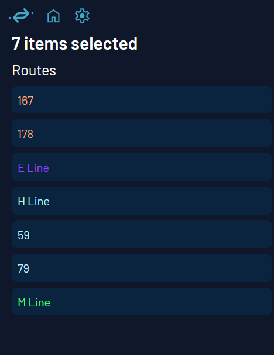
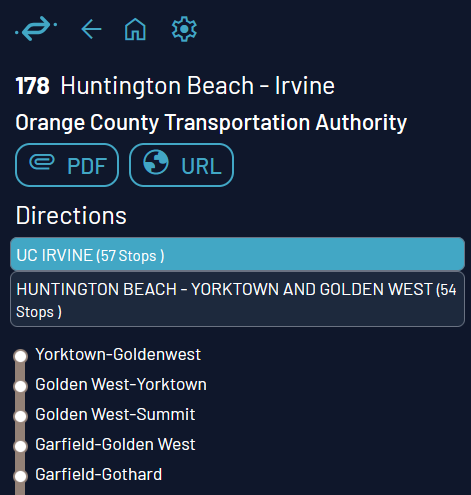

# Übersicht der Kartenfunktionen

*Eine Kurzanleitung zu Catenary für Gelegenheitsnutzer!*

Fühlen Sie sich frei, die Karte zu öffnen und mitzumachen! Das bedeutet, dass Sie auf unsere Website gehen, [hier](https://maps.catenarymaps.org). (Wir arbeiten daran, eine herunterladbare Version zu erstellen.)

## Anzeigemenü

Wir wissen, dass es für manche sehr überwältigend sein kann, alle Ebenen offen zu haben, während andere den Trubel genießen, alles zu sehen, was wir zu bieten haben. Also lassen wir Sie entscheiden, was Sie sehen wollen!

Um unsere Ebenen umzuschalten, gehen Sie in die obere rechte Ecke und werfen Sie einen Blick auf die Ebenen-Schaltfläche (eine stilisierte Rautenform), die über dem Kompass (roter Pfeil oben auf dem Buchstaben "N") sitzt. Klicken Sie auf die Raute, und ein kleines Kästchen mit zwei Reihen von Symbolen wird in der unteren rechten Ecke auftauchen!

Die erste Reihe steuert, welche Verkehrsfunktionen auf der Karte angezeigt werden. Nennen wir dies die Ebenensteuerung.

Hier können Sie auswählen, ob die Karte Folgendes anzeigt:
- Verkehrsrouten als Linien gezeichnet
- Routen-ID-Labels für angezeigte Routen
- Haltestellen als kleine Blasen
- Namensschilder für angezeigte Haltestellen
- Echtzeit-Fahrzeuge, die sich bewegen

Zum Beispiel zeigt das folgende Bild alles oben Genannte, außer Fahrzeuge:

Als nächstes steuert die zweite Reihe, welche Fahrzeugindikatoren angezeigt werden. Nennen wir dies die Fahrzeugsteuerung.

Hier können Sie auswählen, ob angezeigte Fahrzeuge Folgendes anzeigen:
- aktuelle Routennummer
- Fahrt-ID
- Fahrzeug-ID des Verkehrsbetriebs
- aktuelles Zielschild
- aktuelle Geschwindigkeit
- aktuelle Belegung (voll, leer, dazwischen usw.) als Symbol

Zum Beispiel zeigt das folgende Bild alles oben Genannte:

## Die Seitenleiste

Hier können Sie Einstellungen anpassen und detaillierte Informationen zu Routen und Fahrzeugen anzeigen!

2. Stellen Sie sicher, dass Sie die Ortungsdienste aktiviert haben und dass Catenary die Berechtigung hat, Ihren Standort zu sehen. Auf diese Weise öffnet sich die Karte automatisch in Ihrer Nähe. Keine Sorge, wir sammeln keine Benutzerdaten; wir können die Standorte unserer Benutzer nicht verfolgen!  

3. Werfen Sie einen Blick auf diesen oberen Teil der Seitenleiste! Beginnend beim Logo von links nach rechts, von oben nach unten, haben wir die folgenden Symbole:

- Blaues Catenary-Logo: führt Sie zur Startseite unserer Website
- Blauer Aktualisieren (gebogener Pfeil): aktualisiert die Anzeige der Abfahrten in der Nähe
- Blaues Zahnrad: Öffnet die Benutzereinstellungen (Anzeigesprache usw.). Wir werden später in einem eigenen Abschnitt darüber sprechen!
- Grüner Pfeil: zoomt auf Ihren aktuellen Standort, falls aktiviert
- Violetter umgekehrter Tropfen-Pin + Quadrat mit Kreis darin (Kartenstandortmarkierung): Zeigt einen beweglichen Pin an, den Sie per Drag & Drop über den Bildschirm ziehen können!
- Grauer Filter: Wählen Sie die Art des Verkehrs, den Sie sehen möchten (Bahn, U-Bahn/Straßenbahn, Bus und Sonstige)

Diese sind alle benutzerinteragierbar. Probieren Sie es einfach aus!

## Nutzung der Abfahrten in der Nähe

Das Hauptmerkmal unserer Seitenleiste ist es, die Abfahrten in der Nähe entweder zu Ihrem Standort oder dort anzuzeigen, wo der violette Pin auf der Karte platziert ist!

Für eine detaillierte Methodik können Sie sich die technische Seite unserer Dokumentation für Mitwirkende ansehen, aber um es kurz zusammenzufassen: Unser System sucht nach nahegelegenen Haltestellen und findet die Fahrten, die bald von jeder von ihnen abfahren, und sortiert sie nach Route und Richtung!

Sie können auf eine bestimmte Fahrt klicken, um detaillierte Informationen darüber zu sehen --- wann das Fahrzeug seine erste Haltestelle verlässt, wann es an jeder folgenden Haltestelle ankommt und wie viel Verspätung oder Vorsprung es hat. Dies hebt auch die Route auf der Karte hervor, selbst wenn Sie diese Kartenebene nicht angezeigt haben!

Wenn Sie zum vorherigen Bildschirm zurückkehren möchten, drücken Sie die Home-Taste, die anstelle des Aktualisierungssymbols erscheint, sobald Sie auf eine bestimmte Route klicken.

## Die Karte

Lassen Sie uns einige grundlegende Navigationsschritte durchgehen!

**Für PC-Benutzer:**
- Linksklick und ziehen, um sich auf der Karte zu bewegen
- Verwenden Sie das Mausrad (Maus) oder zoomen Sie mit zwei Fingern (Touchpad), um hinein- und herauszuzoomen
- Halten Sie die rechte Maustaste gedrückt und bewegen Sie die Maus nach rechts/links (Maus) oder ziehen Sie den Finger nach rechts/links (Touchpad), um die Himmelsrichtung zu ändern
- Halten Sie die rechte Maustaste gedrückt und bewegen Sie die Maus nach oben/unten (Maus) oder ziehen Sie den Finger nach oben/unten (Touchpad), um die Neigung zu ändern (3D-Modus)

**Für Touchscreen-Benutzer:**
- Tippen und ziehen, um sich auf der Karte zu bewegen
- Mit zwei Fingern kneifen, um hinein- und herauszuzoomen
- Mit zwei Fingern drehen, um die Himmelsrichtung der Karte zu ändern
- Mit zwei Fingern nach oben ziehen, um die Neigung der Karte zu ändern (3D-Modus)
 

Klicken/tippen Sie auf einen Punkt auf einer Karte, um zu sehen, welche angezeigten Routen durch diesen Punkt führen! Es wird eine Liste der Routen in der Seitenleiste geben. Sie können mit diesen interagieren! Wenn Sie auf eine Route aus dieser Liste klicken, wird das Liniendiagramm auf der Karte hervorgehoben und ihre Fahrtvarianten in der Seitenleiste angezeigt. Dies bedeutet, dass Sie eine Liste der Haltestellen sehen können, die die Route passiert, Links zum Verkehrsbetrieb, ein PDF der Taktzeiten (geplante Abfahrten), falls verfügbar, und mehr. Sie können diese Ansicht auch erhalten, indem Sie auf Fahrzeuge klicken, wodurch die Fahrt und das Liniendiagramm angezeigt werden

