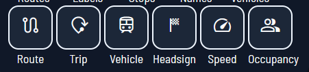
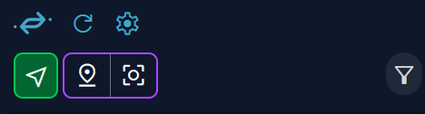
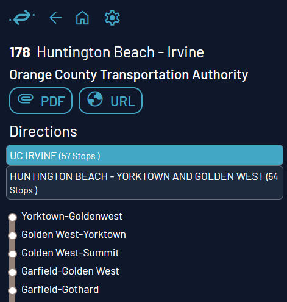

# Map Features Overview

*A quick guide to Catenary for the casual user!*

Feel free to open up the map and follow along! This means going to our website, over [here](https://maps.catenarymaps.org). (We're working on making a downloadable version.)

## Display Menu

We know that having all the layers open can be very overwhelming for some, while others enjoy the hubbub of seeing everything we have to offer at once. So, we let you decide what you want to see!

To toggle our layers, go to the top right hand corner and take a look at the layer (a stylized diamond shape) button, sitting on top of the compass (red arrow on top on the letter "N"). Click on the diamond, and a little box with two rows of icons will pop up in the bottom right hand corner!

The first row controls what transit features show up on the map. Let's call this the Layer Control.

Here, you can select whether the maps shows:
- transit routes drawn out as lines
- route ID labels for displayed routes
- stops as little bubbles
- name lables for displayed stops 
- real-time vehicles moving around

For example, the following image shows all of the above, except vehicles:

Next, the second row controls what vehicle indicators are displayed. Let's call this the Vehicle Control.

Here, you can select whether displayed vehicles indicate their:
- current route number
- trip ID
- agency vehicle ID
- current headsign
- current speed
- current occupancy (full, empty, in between, etc.) as a symbol

For example, the following image shows all of the above:

 
## The Sidebar

This is how to adjust settings and view detailed information on routes and vehicles!

2. Make sure you have location services on and that Catenary has permission to view your location. This way, the map will automatically open up near where you are. Don't worry, we don't collect any user data; we can't track our users' locations!   

3. Take a look at this top part of the sidebar! Starting from the logo and going left-to-right, up-to-down, we have the following icons:

- Blue Catenary logo: takes you to home page of our website
- Blue Refresh (curved arrow): refreshes the Nearby Departures display
- Blue Gear: Opens user settings (display language, etc.) We'll talk about this in its own section later on!
- Green Arrow: zooms in on your current location, if enabled
- Purple Inverted-drop Pin + Square with circle in it (map location marker): Shows a movable pin which you can drag and drop around the screen!
- Gray Filter: pick the type of transit you want to see (Rail, Metro/Tram, Bus, and Other)

These are all user-interactable. Go ahead and give it a try!.

## Using Nearby Departures

The main feature of our sidebar is to show the Nearby Departures to either your location or where the purple pin is placed on the map!

For detailed methodology, you can check out the technical side of our docs for contributors, but to quickly summarize, our system looks for nearby transit stations and finds the trips departing soon from each of them, and sorts it by route and direction!

You can click on a specific trip to see detailed information about it --- when the vehicle leaves its first stop, when it arrives at each subsequent stop, and how much its delayed or early by. This also highlights the route on the map as well, even if you don't have that map layer displayed! 

If you want to return to a previous screen, press the Home button that shows up in place of the refresh symbol once you click on a specific route.

## The Map

Let's go over some basic navigation!

**For PC Users:**
- Left click and drag to move around the map
- Use the scroll wheel (mouse) or pinch with two fingers (touchpad) to zoom in and out
- Hold right click, and move mouse right/left (mouse) or drag finger right/left (touchpad) to change cardinal orientation
- Hold right click, and move mouse up/down (mouse) or drag finger up/down (touchpad) to change the tilt (3D mode)

**For Touchscreen Users:**
- Tap and drag to move around the map
- Pinch with two fingers to zoom in and out
- Rotate with two fingers to change the cardinal orientation of the map
- Drag up with two fingers to change the tilt of the map (3D mode)
 

Click/tap on a spot on a map to see what displayed routes pass through that point! There will be a list of the routes on the sidebar. You can interact with these! If you click on a route from this list, it will highlight the line diagram on the map and show its trip variations on the sidebar.  This means you can see a list of the stops the route passes through, links to the transit agency, a PDF of headways (planned departures) if availble, and more. You can also get this view by clicking on vehicles, which will show the trip and the line diagram

 