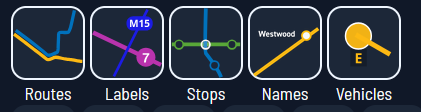
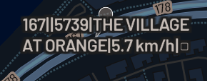

# Descripción General de las Funciones del Mapa

*¡Una guía rápida de Catenary para el usuario casual!*

¡Siéntete libre de abrir el mapa y seguirnos! Esto significa ir a nuestro sitio web, por [aquí](https://maps.catenarymaps.org). (Estamos trabajando en hacer una versión descargable).

## Menú de Visualización

Sabemos que tener todas las capas abiertas puede ser muy abrumador para algunos, mientras que otros disfrutan del bullicio de ver todo lo que tenemos para ofrecer a la vez. ¡Así que te dejamos decidir qué quieres ver!

Para alternar nuestras capas, ve a la esquina superior derecha y echa un vistazo al botón de capa (una forma de diamante estilizada), situado encima de la brújula (flecha roja sobre la letra "N"). ¡Haz clic en el diamante y aparecerá un pequeño cuadro con dos filas de iconos en la esquina inferior derecha!

La primera fila controla qué características de tránsito aparecen en el mapa. Llamémoslo Control de Capas.

Aquí puedes seleccionar si el mapa muestra:
- rutas de tránsito dibujadas como líneas
- etiquetas de ID de ruta para las rutas mostradas
- paradas como pequeñas burbujas
- etiquetas de nombre para las paradas mostradas
- vehículos en tiempo real moviéndose

Por ejemplo, la siguiente imagen muestra todo lo anterior, excepto los vehículos:

A continuación, la segunda fila controla qué indicadores de vehículos se muestran. Llamémoslo Control de Vehículos.

Aquí puedes seleccionar si los vehículos mostrados indican su:
- número de ruta actual
- ID de viaje
- ID de vehículo de la agencia
- letrero de destino actual
- velocidad actual
- ocupación actual (lleno, vacío, intermedio, etc.) como un símbolo

Por ejemplo, la siguiente imagen muestra todo lo anterior:

## La Barra Lateral

¡Así es como ajustas la configuración y ves información detallada sobre rutas y vehículos!

2. Asegúrate de tener los servicios de ubicación activados y de que Catenary tenga permiso para ver tu ubicación. De esta manera, el mapa se abrirá automáticamente cerca de donde estás. ¡No te preocupes, no recopilamos ningún dato de usuario; no podemos rastrear las ubicaciones de nuestros usuarios!  

3. ¡Echa un vistazo a esta parte superior de la barra lateral! Empezando por el logotipo y yendo de izquierda a derecha, de arriba a abajo, tenemos los siguientes iconos:

- Logotipo azul de Catenary: te lleva a la página de inicio de nuestro sitio web
- Actualizar azul (flecha curva): actualiza la pantalla de Salidas Cercanas
- Engranaje azul: Abre la configuración de usuario (idioma de visualización, etc.) ¡Hablaremos de esto en su propia sección más adelante!
- Flecha verde: acerca el mapa a tu ubicación actual, si está habilitada
- Pin de gota invertida púrpura + Cuadrado con círculo dentro (marcador de ubicación del mapa): ¡Muestra un pin móvil que puedes arrastrar y soltar por la pantalla!
- Filtro gris: elige el tipo de tránsito que quieres ver (Ferrocarril, Metro/Tranvía, Autobús y Otros)

Todos estos son interactivos para el usuario. ¡Adelante, pruébalo!

## Usando Salidas Cercanas

¡La característica principal de nuestra barra lateral es mostrar las Salidas Cercanas a tu ubicación o a donde esté colocado el pin púrpura en el mapa!

Para una metodología detallada, puedes consultar el lado técnico de nuestros documentos para colaboradores, pero para resumir rápidamente, ¡nuestro sistema busca estaciones de tránsito cercanas y encuentra los viajes que salen pronto de cada una de ellas, y los ordena por ruta y dirección!

Puedes hacer clic en un viaje específico para ver información detallada sobre él: cuándo sale el vehículo de su primera parada, cuándo llega a cada parada posterior y cuánto retraso o adelanto lleva. ¡Esto también resalta la ruta en el mapa, incluso si no tienes esa capa de mapa mostrada!

Si quieres volver a una pantalla anterior, presiona el botón Inicio que aparece en lugar del símbolo de actualización una vez que haces clic en una ruta específica.

## El Mapa

¡Repasemos algo de navegación básica!

**Para usuarios de PC:**
- Clic izquierdo y arrastrar para moverte por el mapa
- Usa la rueda de desplazamiento (ratón) o pellizca con dos dedos (panel táctil) para acercar y alejar
- Mantén presionado el clic derecho y mueve el ratón hacia la derecha/izquierda (ratón) o arrastra el dedo hacia la derecha/izquierda (panel táctil) para cambiar la orientación cardinal
- Mantén presionado el clic derecho y mueve el ratón hacia arriba/abajo (ratón) o arrastra el dedo hacia arriba/abajo (panel táctil) para cambiar la inclinación (modo 3D)

**Para usuarios de pantalla táctil:**
- Toca y arrastra para moverte por el mapa
- Pellizca con dos dedos para acercar y alejar
- Rota con dos dedos para cambiar la orientación cardinal del mapa
- Arrastra hacia arriba con dos dedos para cambiar la inclinación del mapa (modo 3D)
 

¡Haz clic/toca en un punto en un mapa para ver qué rutas mostradas pasan por ese punto! Habrá una lista de las rutas en la barra lateral. ¡Puedes interactuar con ellas! Si haces clic en una ruta de esta lista, resaltará el diagrama de línea en el mapa y mostrará sus variaciones de viaje en la barra lateral. Esto significa que puedes ver una lista de las paradas por las que pasa la ruta, enlaces a la agencia de tránsito, un PDF de intervalos (salidas planificadas) si está disponible, y más. También puedes obtener esta vista haciendo clic en los vehículos, lo que mostrará el viaje y el diagrama de línea.

