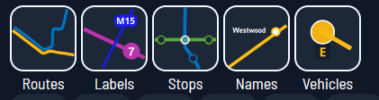
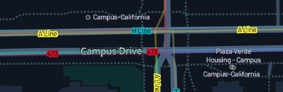
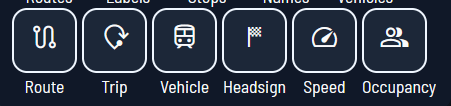
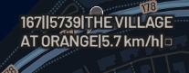

# Map Features Overview
For the casual user!

Feel free to open up the map and follow along! This means going to our website, over [here](https://maps.catenarymaps.org). (We're working on a downloadable version.)

## Display Menu

We know that having all the layers open can be very overwhelming for some, while others enjoy the hubbub of seeing everything we have to offer at once. So, we let you decide what you want to see!

To toggle our layers, go to the top right hand corner and take a look at the layer (a stylized diamond shape) button, sitting on top of the compass (red arrow on top on the letter "N"). Click on the diamond, and a little box with two rows of icons will pop up in the bottom right hand corner!

The first row controls what transit features show up on the map. Let's call this the Layer Control.

Here, you can select whether the maps shows:
- transit routes drawn out as lines
- route ID labels for displayed routes
- stops as little bubbles
- name lables for displayed stops 
- real-time vehicles moving around

For example, the following image shows all of the above, except vehicles:

Next, the second row controls what vehicle indicators are displayed. Let's call this the Vehicle Control.

Here, you can select whether displayed vehicles indicate their:
- current route number
- trip ID
- agency vehicle ID
- current headsign
- current speed
- current occupancy (full, empty, in between, etc.) as a symbol

For example, the following image shows all of the above:

 
## The Sidebar

This is how to adjust settings and view detailed information on routes and vehicles!

2. Make sure you have location services on and that Catenary has permission to view your location. This way, the map will automatically open up near where you are. Don't worry, we don't collect any user data; we can't track our users' locations!   

3. 

4. Make sure you're caught up with all of the details about GitHub and Workflow
